## Exercise 1: Migrate the on-premises database to Azure SQL Database

Duration: 45 minutes

In this exercise, you use the Microsoft Data Migration Assistant (DMA) to assess the `ContosoInsurance` database for a migration to Azure SQL Database. The assessment generates a report detailing any feature parity and compatibility issues between the on-premises database and Azure SQL Database.

> DMA helps you upgrade to a modern data platform by detecting compatibility issues that can impact database functionality on your new version of SQL Server or Azure SQL Database. DMA recommends performance and reliability improvements for your target environment and allows you to move your schema, data, and uncontained objects from your source server to your target server. To learn more, read the **Data Migration Assistant** documentation here https://docs.microsoft.com/sql/dma/dma-overview?view=azuresqldb-mi-current

### Task 1: Configure the ContosoInsurance database on the SqlServer2008 VM

Before you begin the assessment, you need to configure the `ContosoInsurance` database on your SQL Server 2008 R2 instance. In this task, you execute a SQL script against the `ContosoInsurance` database on the SQL Server 2008 R2 instance.

> **Note**: There is a known issue with screen resolution when using an RDP connection to Windows Server 2008 R2, which may affect some users. This issue presents itself as very small, hard to read text on the screen. The workaround for this is to use a second monitor for the RDP display, which should allow you to scale up the resolution to make the text larger.

1. In the Azure portal, navigate to your **SqlServer2008** VM by selecting **Resource groups** from Azure services list, selecting the **hands-on-lab-SUFFIX** resource group, and selecting the **Sql2008-uniqueid VM** from the list of resources.

   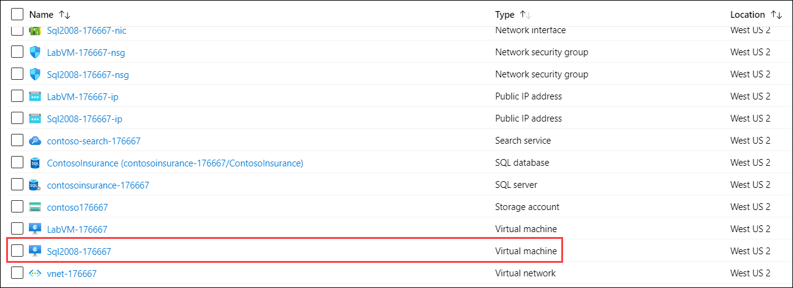

2. On the SqlServer2008 Virtual Machine's **Overview** blade, select **Connect** on the top menu.

   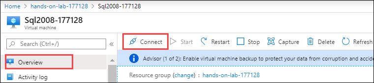

3. On the Connect to virtual machine blade, select **Download RDP File**, then open the downloaded RDP file.

4. Select **Connect** on the Remote Desktop Connection dialog.

   

5. Enter the following credentials when prompted, and then select **OK**:

   - **Username**: ```demouser```
   - **Password**: ```Password.1!!```

   

6. Select **Yes** to connect, if prompted that the identity of the remote computer cannot be verified.

   

7. Once logged into the SqlServer2008 VM, open **Microsoft SQL Server Management Studio** (SSMS) by entering "sql server" into the search bar in the Windows Start menu and selecting **Microsoft SQL Server Management Studio 17** from the results.

   

8. In the SSMS **Connect to Server** dialog, enter **Sql2008-uniqueid** into the Server name box, ensure **Windows Authentication** is selected, and then select **Connect**.

   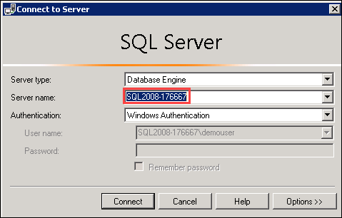

9. Once connected, expand **Databases** under Sql2008-uniqueid in the Object Explorer, and then select **ContosoInsurance** from the list of databases.

    

10. Next, you execute a script in SSMS, which resets the `sa` password, enable mixed mode authentication, create the `WorkshopUser` account, and change the database recovery model to FULL. To create the script, open a new query window in SSMS by selecting **New Query** in the SSMS toolbar.

    

11. Copy and paste the SQL script below into the new query window:

    ```sql
    USE master;
    GO

    -- SET the sa password
    ALTER LOGIN [sa] WITH PASSWORD=N'Password.1!!';
    GO

    -- Enable Mixed Mode Authentication
    EXEC xp_instance_regwrite N'HKEY_LOCAL_MACHINE',
    N'Software\Microsoft\MSSQLServer\MSSQLServer', N'LoginMode', REG_DWORD, 2;
    GO

    -- Create a login and user named WorkshopUser
    CREATE LOGIN WorkshopUser WITH PASSWORD = N'Password.1!!';
    GO

    EXEC sp_addsrvrolemember
        @loginame = N'WorkshopUser',
        @rolename = N'sysadmin';
    GO

    USE ContosoInsurance;
    GO

    IF NOT EXISTS (SELECT * FROM sys.database_principals WHERE name = N'WorkshopUser')
    BEGIN
        CREATE USER [WorkshopUser] FOR LOGIN [WorkshopUser]
        EXEC sp_addrolemember N'db_datareader', N'WorkshopUser'
    END;
    GO

    -- Update the recovery model of the database to FULL
    ALTER DATABASE ContosoInsurance SET RECOVERY FULL;
    GO
    ```

12. To run the script, select **Execute** from the SSMS toolbar.

    

13. For Mixed Mode Authentication and the new `sa` password to take effect, you must restart the SQL Server (MSSQLSERVER) Service on the Sql2008-uniqueid VM. To do this, you can use SSMS. Right-click the Sql2008-uniqueid instance in the SSMS Object Explorer, and then select **Restart** from the context menu.

   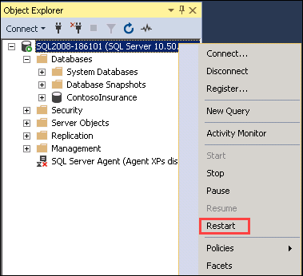

14. When prompted about restarting the MSSQLSERVER service, select **Yes**. The service takes a few seconds to restart.

   

### Task 2: Perform assessment for migration to Azure SQL Database

Contoso would like an assessment to see what potential issues they might need to address in moving their database to Azure SQL Database. In this task, you use the **Microsoft Data Migration Assistant (DMA)** here https://docs.microsoft.com/sql/dma/dma-overview?view=sql-server-2017 to perform an assessment of the `ContosoInsurance` database against Azure SQL Database (Azure SQL DB). Data Migration Assistant (DMA) enables you to upgrade to a modern data platform by detecting compatibility issues that can impact database functionality on your new version of SQL Server or Azure SQL Database. It recommends performance and reliability improvements for your target environment. The assessment generates a report detailing any feature parity and compatibility issues between the on-premises database and the Azure SQL DB service.

> **Note**: The Database Migration Assistant has already been installed on your SqlServer2008 VM. It can also be downloaded from the Microsoft Download Center (https://www.microsoft.com/download/details.aspx?id=53595).

1. On the Sql2008-uniqueid VM, launch DMA from the Windows Start menu by typing "data migration" into the search bar, and then selecting **Microsoft Data Migration Assistant** in the search results.

   

2. In the DMA dialog, select **+** from the left-hand menu to create a new project.

   

3. In the New project pane, set the following:

   - **Project type**: Select ```Assessment```.
   - **Project name**: Enter ```Assessment```.
   - **Assessment type**: Select Database Engine.
   - **Source server type**: Select SQL Server.
   - **Target server type**: Select Azure SQL Database.

   

4. Select **Create**.

5. On the **Options** screen, ensure **Check database compatibility** and **Check feature parity** are both checked, and then select **Next**.

    

6. On the **Sources** screen, enter the following into the **Connect to a server** dialog that appears on the right-hand side:

   - **Server name**: Enter ```Sql2008-uniqueid```
   - **Authentication type**: Select **SQL Server Authentication**.
   - **Username**: Enter ```WorkshopUser```
   - **Password**: Enter ```Password.1!!```
   - **Encrypt connection**: Check this box.
   - **Trust server certificate**: Check this box.

      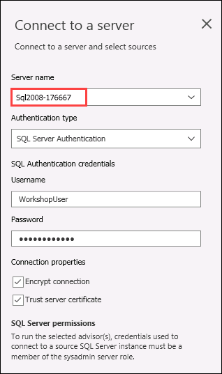

7. Select **Connect**.

8. On the **Add sources** dialog that appears next, check the box for `ContosoInsurance` and select **Add**.

   

9. Select **Start Assessment**.

   

10. Take a moment to review the assessment for migrating to Azure SQL DB. The SQL Server feature parity report shows that Analysis Services and SQL Server Reporting Services are unsupported, but these do not affect any objects in the `ContosoInsurance` database, so won't block a migration.

    

11. Now, select **Compatibility issues** so you can review that report as well.

    

> The DMA assessment for a migrating the `ContosoInsurance` database to a target platform of Azure SQL DB reveals that there are no issues or features preventing Contoso from migrating their database to Azure SQL DB. You can select **Export Assessment** at the top right to save the report as a JSON file, if desired.

### Task 3: Migrate the database schema using the Data Migration Assistant

After you have reviewed the assessment results and you have ensured the database is a candidate for migration to Azure SQL Database, use the Data Migration Assistant to migrate the schema to Azure SQL Database.

1. On the SqlServer2008 VM, return to the Data Migration Assistant, and select the New **(+)** icon in the left-hand menu.

2. In the New project dialog, enter the following:

   - **Project type**: Select ``` Migration ```
   - **Project name**: Enter ``` Migration ```
   - **Source server type**: Select SQL Server.
   - **Target server type**: Select Azure SQL Database.
   - **Migration scope**: Select Schema only.

   

3. Select **Create**.

4. On the **Select source** tab, enter the following:

   - **Server name**: Enter ```Sql2008-uniqueid```
   - **Authentication type**: Select **SQL Server Authentication**.
   - **Username**: Enter ``` WorkshopUser ```
   - **Password**: Enter ``` Password.1!! ```
   - **Encrypt connection**: Check this box.
   - **Trust server certificate**: Check this box.
   - Select **Connect**, and then ensure the `ContosoInsurance` database is selected from the list of databases.

   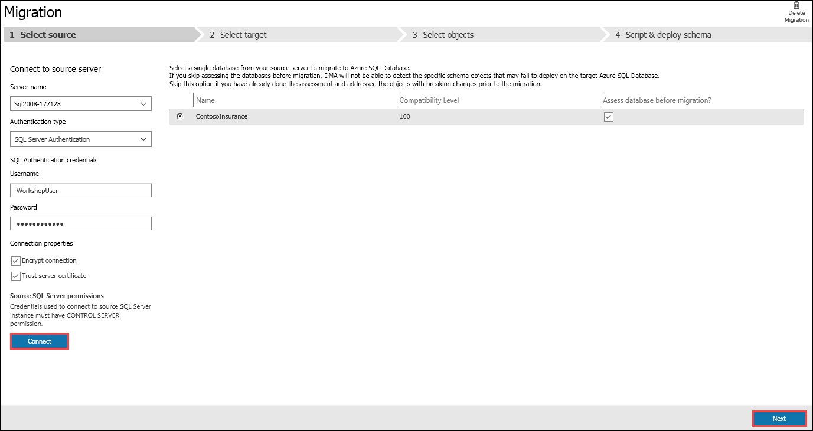

5. Select **Next**.

6. For the **Select target** tab, retrieve the server name associated with your Azure SQL Database. In the Azure portal, navigate to your **SQL database** resource by selecting **Resource groups** from Azure services list, selecting the **hands-on-lab-SUFFIX** resource group, and then selecting the **ContosoInsurance** SQL database resource from the list of resources.

   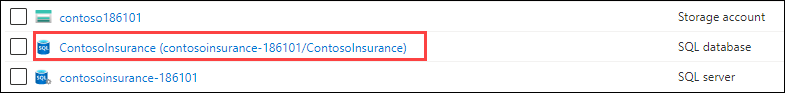

7. On the Overview blade of your SQL database, copy the **Server name** by clicking on the copy to clipboard icon.

   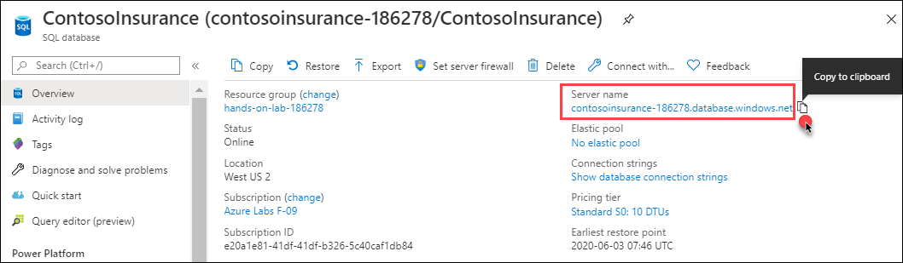

8. Return to DMA, and on the **Select target** tab, enter the following:

   - **Server name**: Paste the server name of your Azure SQL Database you copied above.
   - **Authentication type**: Select SQL Server Authentication.
   - **Username**: Enter ```demouser```
   - **Password**: Enter ```Password.1!!```
   - **Encrypt connection**: Check this box.
   - **Trust server certificate**: Check this box.
   - Select **Connect**, and then ensure the `ContosoInsurance` database is selected from the list of databases.

   

9. Select **Next**.

10. On the **Select objects** tab, leave all the objects checked, and select **Generate SQL script**.

    

11. On the **Script & deploy schema** tab, review the script. Notice the view also provides a note that there are not blocking issues.

    

12. Select **Deploy schema**.

13. After the schema is deployed, review the deployment results, and ensure there were no errors.

    

14. Next, open SSMS on the Sql2008-uniqueid VM, and connect to your Azure SQL Database, by selecting **Connect->Database Engine** in the Object Explorer, and then entering the following into the Connect to server dialog:

    - **Server name**: Paste the server name of your Azure SQL Database you copied above.
    - **Authentication type**: Select SQL Server Authentication.
    - **Username**: Enter ```demouser```
    - **Password**: Enter ```Password.1!!```
    - **Remember password**: Check this box.

   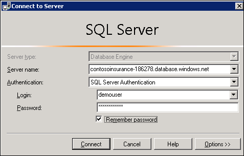

15. Select **Connect**.

16. Once connected, expand **Databases**, and expand **ContosoInsurance**, then expand **Tables**, and observe the schema has been created.

   

### Task 4: Retrieve connection information for SQL databases

In this task, you use the Azure Cloud shell to retrieve the IP address of the SqlServer2008 VM, which is needed to connect to your Sql2008-uniqueid VM from DMS.

1. In the Azure portal, select the Azure Cloud Shell icon from the top menu.

    

2. In the Cloud Shell window that opens at the bottom of your browser window, select **PowerShell**.

    

3. Now you need to select **Advanced settings** and specify the subscription, region and resource group for the new storage account as mentioned below:

4. Click on **Show Advanced Settings**.

      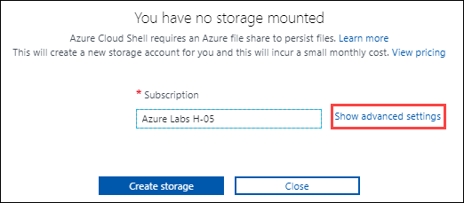
      
5. Use exisiting hands-on-lab-SUFFIX resource group and for:
   - **storage account**: Create new and enter sa{uniqueid}, for example: sa176667.
   - **file share**: Create new and enter fs{uniqueid}, for example: fs176667.
      
   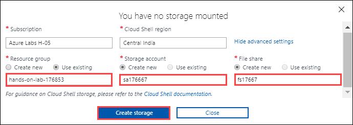
     
 Then select **Create Storage**.

6. After a moment, a message that you have successfully requested a Cloud Shell appears, and a PS Azure prompt is displayed.

    

7. At the prompt, enter the following command, **replacing `<your-resource-group-name>`** with the name resource group:

    ```powershell
    $resourceGroup = "<your-resource-group-name>"
    ```

8. Next, retrieve the public IP address of the Sql2008-uniqueid VM, which is used to connect to the database on that server. Enter and run the following PowerShell command:

    ```powershell
    az vm list-ip-addresses -g $resourceGroup -n Sql2008-uniqueid --output table
    ```

- Replace SqlServer2008 with name of your SQLVM. It will look similar to the one as following:

    ```
    az vm list-ip-addresses -g $resourceGroup -n Sql2008-176667 --output table
    ```

    > **Note**: If you have multiple Azure subscriptions, and the account you are using for this hands-on lab is not your default account, you may need to run `az account list --output table` at the Azure Cloud Shell prompt to output a list of your subscriptions, then copy the Subscription Id of the account you are using for this lab, and then run `az account set --subscription <your-subscription-id>` to set the appropriate account for the Azure CLI commands.

9. Within the output of the command above, locate and copy the value of the `ipAddress` property within the `publicIPAddresses` object. Paste the value into a text editor, such as Notepad.exe, for later reference.

   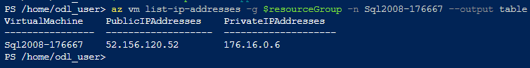 

10. Next, run a second command to retrieve the server name of your Azure SQL Database:

    ```powershell
    az sql server list -g $resourceGroup
    ```

    

11. Copy the **fullyQualifiedDomainName** value into a text editor for use below.

### Task 5: Migrate the database using the Azure Database Migration Service

At this point, you have migrated the database schema using DMA. In this task, you migrate the data from the `ContosoInsurance` database into the new Azure SQL Database using the Azure Database Migration Service.

> The Azure Database Migration Service (https://docs.microsoft.com/azure/dms/dms-overview) integrates some of the functionality of Microsoft existing tools and services to provide customers with a comprehensive, highly available database migration solution. The service uses the Data Migration Assistant to generate assessment reports that provide recommendations to guide you through the changes required prior to performing a migration. When you're ready to begin the migration process, Azure Database Migration Service performs all of the required steps.

1. In the Azure portal, navigate to your Azure Database Migration Service by selecting **Resource groups** from Azure services list, selecting the **hands-on-lab-SUFFIX** resource group, and then selecting the **contoso-dms-UniqueId** Azure Database Migration Service in the list of resources.

   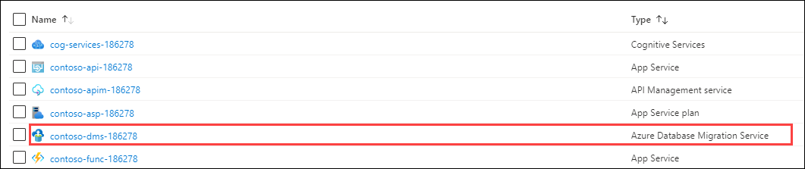

2. On the Azure Database Migration Service blade, select **+New Migration Project**.

   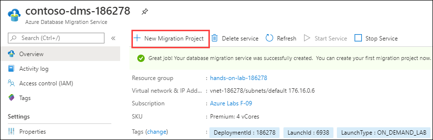

3. On the New migration project blade, enter the following:

    - **Project name**: Enter DataMigration.
    - **Source server type**: Select SQL Server.
    - **Target server type**: Select Azure SQL Database.
    - **Choose type of activity**: Let it be on default i.e. **Offline data migration**.

    

4. Select **Create and run activity**.

5. On the Migration Wizard **Select source** blade, enter the following:

    - **Source SQL Server instance name**: Enter the IP address of your Sql2008-uniqueid VM that you copied into a text editor in the previous task. For example, `51.143.12.114`.
    - **Authentication type**: Select SQL Authentication.
    - **Username**: ```WorkshopUser```
    - **Password**: ```Password.1!!```
    - **Connection properties**: Check both Encrypt connection and Trust server certificate. Then select **Save**.

   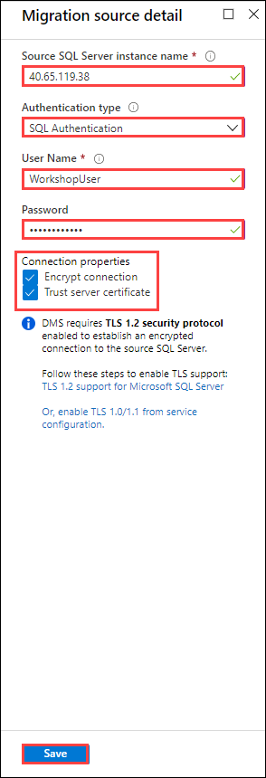 

6. On the Migration Wizard **Select target** blade, enter the following:

    - **Target server name**: Enter the `fullyQualifiedDomainName` value of your Azure SQL Database (e.g., contosoinsurance-jt7yc3zphxfda.database.windows.net), which you copied in the previous task.
    - **Authentication type**: Select SQL Authentication.
    - **Username**: ```demouser```
    - **Password**: ```Password.1!!```
    - **Connection properties**: Check Encrypt connection.

    

7. Select **Save**.

8. On the Migration Wizard **Map to target databases** blade, confirm that **ContosoInsurance** is checked as the source database, and that it is also the target database on the same line, then select **Save**.

    

9. Select **Save**.

10. On the Migration Wizard **Configure migration settings** blade, expand the **ContosoInsurance** database and verify all the tables are selected.

    

11. Select **Save**.

12. On the Migration Wizard **Summary** blade, enter the following:

    - **Activity name**: ```ContosoDataMigration```

   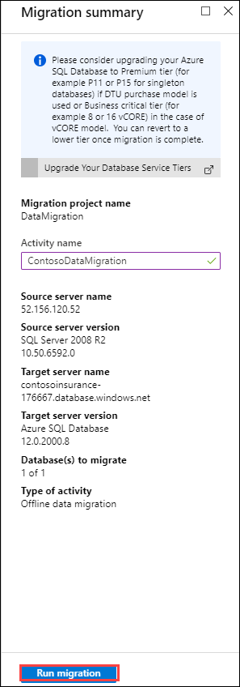

13. Select **Run migration**.

14. Monitor the migration on the status screen that appears. Select the refresh icon in the toolbar to retrieve the latest status.

    

    > The migration takes approximately 2 - 3 minutes to complete.

15. When the migration is complete, you should see the status as **Completed**.

    

16. Click on **Next** button.
