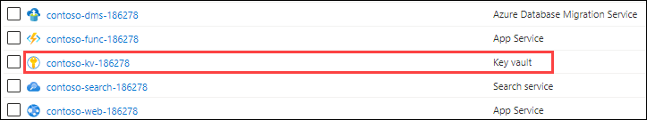
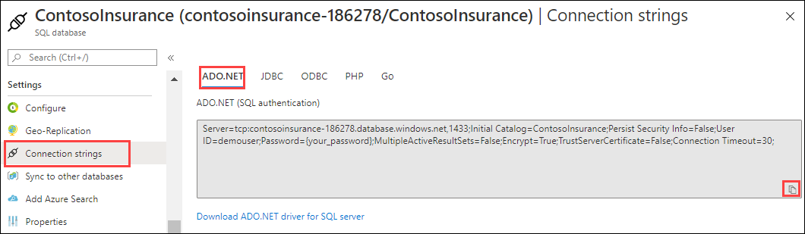
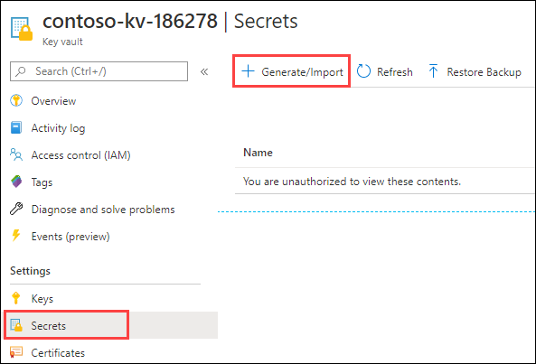
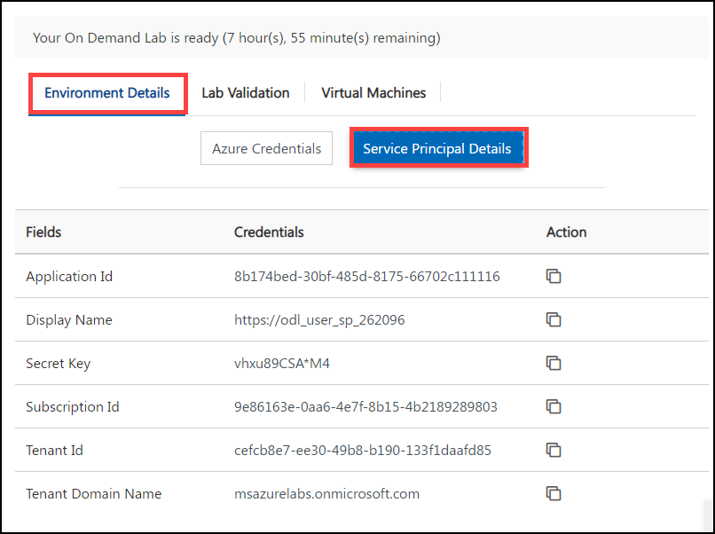
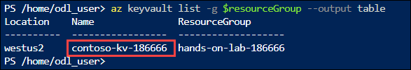

## Exercise 3: Configure Key Vault

Duration: 15 minutes

As part of their efforts to put tighter security controls in place, Contoso has requested that application secrets to be stored in a secure manner, so they aren't visible in plain text in application configuration files. In this exercise, you configure Azure Key Vault, which securely stores application secrets for the Contoso web and API applications, once migrated to Azure.

### Task 1: Add Key Vault access policy

In this task, you add an access policy to Key Vault to allow secrets to be created with your account.

1. In the Azure portal, navigate to your **Key Vault** resource by selecting **Resource groups** from Azure services list, selecting the **hands-on-lab-SUFFIX** resource group, and then selecting the **contoso-kv-UniqueId** Key vault resource from the list of resources.

  

2. On the Key Vault blade, select **Access policies** under Settings in the left-hand menu, and then select **+ Add Access Policy**.

    

3. In the Add access policy dialog, enter the following:

   - **Configure from template (optional)**: Leave blank.
   - **Key permissions**: Leave set to 0 selected.
   - **Secret permissions**: Select this, and then choose **Select All**, to give yourself full rights to manage secrets.
   - **Certificate permissions**: Leave set to 0 selected.
   - **Select principal**: Enter the email address of the account you are logged into the Azure portal with, select the user object that appears, and then choose **Select**.
   - **Authorized application**: Leave set to None selected.

   

4. Select **Add**.

5. Select **Save** on the Access policies toolbar.

   

### Task 2: Create a new secret to store the SQL connection string

In this task, you add a secret to Key Vault containing the connection string for the `ContosoInsurance` Azure SQL database.

1. First, you need to retrieve the connection string to your Azure SQL Database. In the Azure portal, navigate to your **SQL database** resource by selecting **Resource groups** from Azure services list, selecting the **hands-on-lab-SUFFIX** resource group, and then selecting the **ContosoInsurance** SQL database resource from the list of resources.

  

2. On the SQL database blade, select **Connection strings** present under **Settings** pane, and then copy the ADO.NET connection string.

  

3. Paste the copied connection string into a text editor, such as Notepad.exe. This is necessary because you need to replace the tokenized password value before adding the connection string as a Secret in Key Vault.

4. In the text editor, find and replace the tokenized `{your_password}` value with `Password.1!!`.

5. Your connection string should now resemble the following:

    ```csharp
    Server=tcp:contosoinsurance-jt7yc3zphxfda.database.windows.net,1433;Initial Catalog=ContosoInsurance;Persist Security Info=False;User ID=demouser;Password=Password.1!!;MultipleActiveResultSets=False;Encrypt=True;TrustServerCertificate=False;Connection Timeout=30;
    ```

6. Copy your updated connection string from the text editor.

7. In the Azure portal, navigate back to your **Key Vault** resource by selecting **Resource groups** from Azure services list, selecting the **hands-on-lab-SUFFIX** resource group, and then selecting the **contoso-kv-UniqueId** Key vault resource from the list of resources.

  

8. On the Key Vault blade, select **Secrets** under Settings in the left-hand menu, and then select **+ Generate/Import**.

  

9. On the Create a secret blade, enter the following:

    - **Upload options**: Select Manual.
    - **Name**: Enter **SqlConnectionString**
    - **Value**: Paste the updated SQL connection string you copied from the text editor.

    

10. Select **Create**.

### Task 3: Retrieve service principal details

Your environment has a pre-created Service Principal for which details are provided along. The service principal (SP) is used to provide your web and API apps access to secrets stored in Azure Key Vault.

1. Now to retrieve the details of Service Principal click on **Environment Details** tab then select **Service Principal Details** and you can review it as shown below:
  
    

### Task 4: Assign the service principal access to Key Vault

In this task, you assign the service principal a reader role on your resource group and add an access policy to Key Vault to allow it to view secrets stored there.

1. Enter the following command at the Cloud Shell prompt, by replacing `<your-subscription-id>` with the value you copied above and `<your-resource-group-name>` with the name of your **hands-on-lab-SUFFIX** resource group, and then press **Enter** to run the command:

   ```
   $subscriptionId = "<your-subscription-id>"
   $resourceGroup = "<your-resource-group-name>"
   ```

2. Next, run the following command to get the name of your Key Vault:

    ```powershell
    az keyvault list -g $resourceGroup --output table
    ```

3. In the output from the previous command, copy the value from the `name` field into a text editor. You use it in the next step and also for configuration of your web and API apps.

   

4. To assign permissions to your service principal to read Secrets from Key Vault, run the following command, replacing `<your-key-vault-name>` with the name of your Key Vault that you copied in the previous step and pasted into a text editor and replacing **http://contoso-apps** in --spn with the **application id** of the pre-created service principal that you can copy from lab details page.

   ```
   az keyvault set-policy -n <your-key-vault-name> --spn http://contoso-apps --secret-permissions get list
   ```
    
 After replacing both the values the command will look similar to one shown below:
 
 ```
   az keyvault set-policy -n contoso-kv-uniqueid --spn 43c4ce7d-ff70-4e08-b438-b80897b0b9c7 --secret-permissions get list
 ```

5. In the output, you should see your service principal appId listed with "get" and "list" permissions for secrets.

    
    
6. Click on **Next** button.
