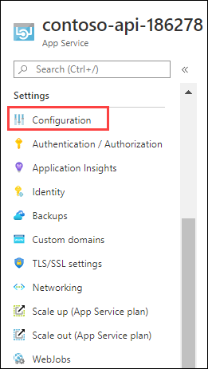
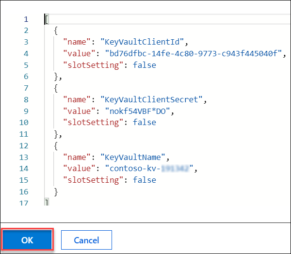
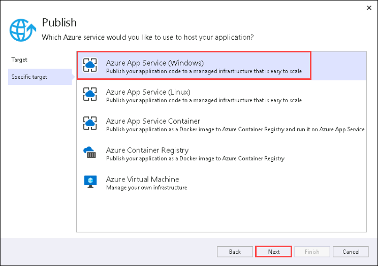
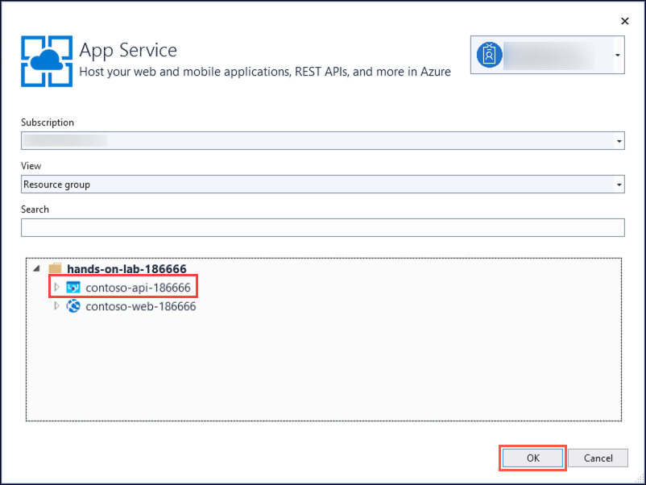
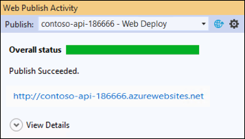
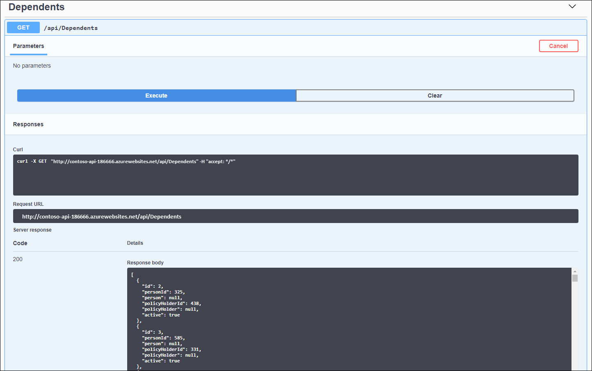

## Exercise 4: Deploy Web API into Azure App Services

Duration: 45 minutes

The developers at Contoso have been working toward migrating their apps to the cloud, and they have provided you with a starter solution developed using ASP.NET Core 2.2. As such, most of the pieces are already in place to deploy the apps to Azure, as well as configure them to communicate with the new app services. Since the required services have already been provisioned, what remains is to integrate Azure Key Vault into the API, apply application-level configuration settings, and then deploy the apps from the Visual Studio starter solution. In this task, you apply application settings to the Web API using the Azure Portal. Once the application settings have been set, you deploy the Web App and API App into Azure from Visual Studio.

### Task 1: Connect to the LabVM

In this task, you open an RDP connection to the LabVM, and downloading a copy of the starter solution provided by Contoso. The application deployments are handled using Visual Studio 2019, installed on the LabVM.

1. Connect to the **LabVM** from you lab details page by clicking on **Go to LABVM-Unique Id** button.

   

### Task 2: Open starter solution with Visual Studio

In this task, you open the `Contoso` starter solution in Visual Studio. The Visual Studio solution contains the following projects:

- **Contoso.Azure**: Common library containing helper classes used by other projects within the solution to communicate with Azure services.
- **Contoso.Data**: Library containing data access objects.
- **Contoso.FunctionApp**: Contains an Azure Function that is used to retrieve policy documents from Blob storage.
- **Contoso.Web**: ASP.NET Core 2.2 PolicyConnect web application.
- **Contoso.WebApi**: ASP.NET Core 2.2 Web API used by the web application to communicate with the database.

1. In File Explorer, navigate to `C:\MCW\MCW-App-modernization-master\Hands-on lab\lab-files\src` and double-click the `Contoso.sln` file to open the solution in Visual Studio.

   

2. If prompted about how to open the file, select **Visual Studio 2019** and then select **OK**.

    

3. Sign in to Visual Studio using your Azure account credentials.

    

4. When prompted with a security warning, uncheck **Ask me for every project in this solution**, and then select **OK**.

    

### Task 3: Update Web API to use Key Vault

In this task, you update the `Contoso.WebApi` project to use Azure Key Vault for storing and retrieving application secrets. You start by adding the connection information to the `appsettings.json` file in the `Contoso.WebApi` project, and then add some code to enable the use of Azure Key Vault.

> The required NuGet package to enable interaction with Key Vault has already been referenced in the project to save time. The package added to facilitate this is: `Microsoft.Extensions.Configuration.AzureKeyVault`.

1. In Visual Studio, expand the `Contoso.WebApi` project in the Solution Explorer, locate the `Program.cs` file and open it by double-clicking on it.

    

2. In the `Program.cs` file, locate the `TODO #1` block (line 23) within the `CreateWebHostBuilder` method.

    

3. Complete the code within the block, using the following code, to add Key Vault to the configuration, and provide Key Vault with the appropriate connection information.

    ```csharp
    config.AddAzureKeyVault(
        KeyVaultConfig.GetKeyVaultEndpoint(buildConfig["KeyVaultName"]),
        buildConfig["KeyVaultClientId"],
        buildConfig["KeyVaultClientSecret"]
    );
    ```

4. Save `Program.cs`. The updated `CreateWebHostBuilder` method should now look like the following:

    

5. Next, you update the `Startup.cs` file in the `Contoso.WebApi` project. Locate the file in the Solution Explorer and double-click it.

6. In the previous exercise, you added the connection string for your Azure SQL Database to Key Vault, and assigned the secret a name of `SqlConnectionString`. Using the code below, update the `TODO #2` block (line 38), within the `Startup.cs` file's `Configuration` property. This allows your application to retrieve the connection string from Key Vault using the secret name.

    

    ```csharp
    services.AddDbContext<ContosoDbContext>(options =>
        options.UseSqlServer(Configuration["SqlConnectionString"]));
    ```

7. Save `Startup.cs`. The updated `Configuration` property now looks like the following:

    

8. Your Web API is now fully configured to retrieve secrets from Azure Key Vault.

### Task 4: Copy KeyVault configuration section to API App in Azure

Before deploying the Web API to Azure, you need to add the required application settings into the configuration for the Azure API App. In this task, you use the advanced configuration editor in your API App to add in the configuration settings required to connect to and retrieve secrets from Key Vault.

1. In the Azure portal, navigate to your **API App** by selecting **Resource groups** from Azure services list, selecting the **hands-on-lab-SUFFIX** resource group, and selecting the **contoso-api-UniqueId** App service from the list of resources.

   

2. On the API App blade, select **Configuration** on the left-hand menu.

   

3. On the Application settings tab of the Configuration blade, select **Advanced edit** under Application settings. The Advanced edit screen allows you to paste JSON directly into the configuration.

    

4. We are going to use the Advanced editor to add all three of the Key Vault settings at once. To do this, we are going to replace the content of the Advanced editor with the following, which you need to update as follows:

    - `<your-key-vault-name>`: ```contoso-kv-UniqueId```, Get UniqueId value from Environment Details under Lab Environment tab  and replace with UniqueId in contoso-kv-UniqueId.
    - `<Application Id>`: you can retrieve this value from Service Principal Details under Lab Environment tab.
    - `<Secret Key>`:  you can retrieve this valuefrom Service Principal Details under Lab Environment tab.

   ```json
    [
        {
            "name": "KeyVaultClientId",
            "value": "<Application Id>"
        },
        {
            "name": "KeyVaultClientSecret",
            "value": "<Secret Key>"
        },
        {
            "name": "KeyVaultName",
            "value": "<your-key-vault-name>"
        }
    ]
   ```

5. The final contents of the editor should look similar to the following:

    ```json
    [
        {
            "name": "KeyVaultClientId",
            "value": "bd76dfbc-14fe-4c80-9773-c943f445040f"
        },
        {
            "name": "KeyVaultClientSecret",
            "value": "nokf54VBF*DO"
        },
        {
            "name": "KeyVaultName",
            "value": "contoso-kv-191342"
        }
    ]
    ```

6. Select **OK**.

    

7. Select **Save** on the Configuration blade.

    

### Task 5: Deploy the API to Azure

In this task, you use Visual Studio to deploy the API project into an API App in Azure.

1. In Visual Studio, right-click on the **Contoso.WebApi** project in the Solution Explorer and select **Publish** from the context menu.

   

2. On **Publish-Where are you publishing today** window, select **Azure** and then click on **Next**.

   

3. Now on **Which Azure service would you like to host your application?** window, select **Azure App Service(Windows)** and click on **Next**.

   

4. Then select your API App (**"contoso-api-uniqueid"**) under your hands-on-lab-SUFFIX resource group.

   

4. Select **OK**.

5. Back on the Visual Studio Publish page for the `Contoso.WebApi` project, select **Publish** to start the process of publishing your Web API to your Azure API App.

   

6. In the Visual Studio **Web Publish Activity** view, you should see a status that indicates the Web API was published successfully, along with the URL to the site.

  

    > If you don't see the **Web Publish Activity** view, you can find it on View menu-> Other Windows -> Microsoft Azure Activity Log.

7. A web browser should open to the published site. If not, open the URL of the published Web API in a browser window. Initially, you should see a message that the page cannot be found.

   

8. To validate the API App is function property, add `/swagger` to the end of the URL in your browser's address bar (e.g., ```https://contoso-api-186666.azurewebsites.net/swagger/```). This brings up the Swagger UI page of your API, which displays a list of the available API endpoints.

    

    > **Note**: Swagger UI (```https://swagger.io/tools/swagger-ui/```) automatically generates visual documentation for REST APIs following the OpenAPI Specification. It makes it easy for developers to visualize and interact with the API's endpoints without having any of the implementation logic in place.

9. You can test the functionality of the API by selecting one of the `GET` endpoints, and selecting **Try it out**.

    

10. Select **Execute**.

    

11. In the Response, you should see a Response Code of 200, and JSON objects in the Response body.

   

12. Click on **Next** button.
