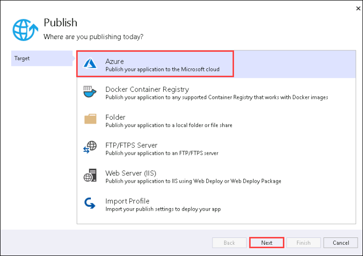
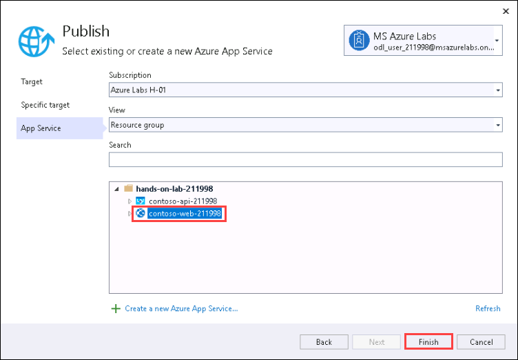
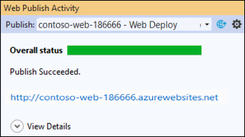
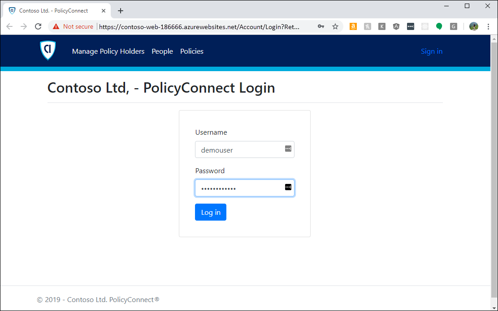
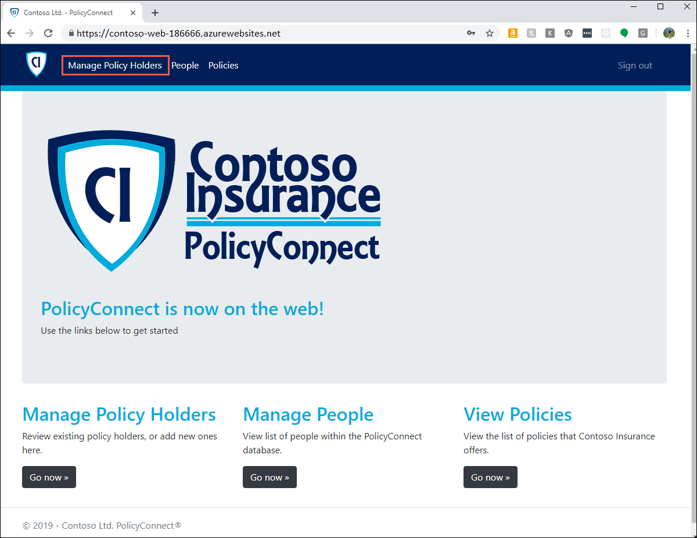
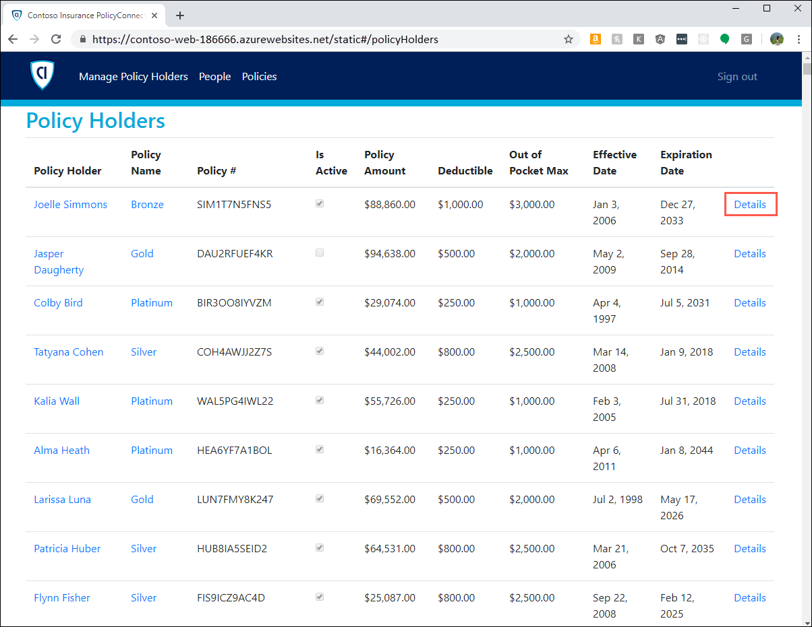
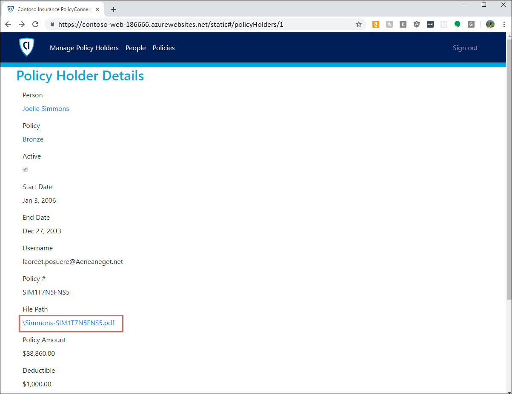

## Exercise 5: Deploy web application into Azure App Services

Duration: 10 minutes

In this exercise, you update the `Contoso.Web` web application to connect to your newly deployed API App and then deploy the web app into Azure App Services.

### Task 1: Add API App URL to Web App Application settings

In this task, you prepare your Web App to work with the API App by adding the URL of your published API App to the Application Settings of your Web App, using the Azure Cloud Shell and Azure CLI.

1. In the Azure portal, select the Azure Cloud Shell icon from the menu at the top right of the screen.

    

2. In the Cloud Shell window that opens at the bottom of your browser window, select **PowerShell**.

    

3. After a moment, you are presented with a PS Azure prompt.

    

4. At the Cloud Shell prompt, run the following command to retrieve both your API App URL and your Web App, making sure to replace `<your-resource-group-name>` with your resource group name:

    ```
    $resourceGroup = "<your-resource-group-name>"
    az webapp list -g $resourceGroup --output table
    ```

    > **Note**: If you have multiple Azure subscriptions, and the account you are using for this hands-on lab is not your default account, you may need to run `az account list --output table` at the Azure Cloud Shell prompt to output a list of your subscriptions, then copy the Subscription Id of the account you are using for this lab, and then run `az account set --subscription <your-subscription-id>` to set the appropriate account for the Azure CLI commands.

5. In the output, copy two values for use in the next step. Copy the **DefaultHostName** value for your API App (the resource name starts with contoso-**api**) and also copy the Web App **Name** value.

   

6. Next replace the tokenized values in the following command as specified below, and then run it from the Azure Cloud Shell command prompt.

    - `<your-web-app-name>`: Replace with your Function App name, which you copied in the previous step.
    - `<your-api-default-host-name>`: Replace with the default hostname of your API app that you copied into a text editor previously.


    ```
    $webAppName = "<your-web-app-name>"
    $defaultHostName = "<your-api-default-host-name>"
    az webapp config appsettings set -n $webAppName -g $resourceGroup --settings "ApiUrl=https://$defaultHostName"
    ```

7. In the output, you should see the newly added setting in your Web App's application settings.

    

### Task 2: Deploy web application to Azure

In this task, you publish the `Contoso.Web` application into an Azure Web App.

1. In Visual Studio on your LabVM, right-click the `Contoso.Web` project in the Solution Explorer, and then select **Manage NuGet Packages** from the context menu.

   

1. On the **NuGet Package Manager** blade, select **Browse** then search for and select **Microsoft.NET.Sdk.Razor** package. Click on **Install** to install the package.

    

1. Once the package installation is done, right-click the `Contoso.Web` project then select **Publish** from the context menu.

    

2. On **Publish-Where are you publishing today** window, select **Azure** and then click on **Next**.

   

3. Now on **Which Azure service would you like to host your application?** window, select **Azure App Service(Windows)** and click on **Next**.

   

4. Then select your Web App (**"contoso-web-uniqueid"**) under your hands-on-lab-SUFFIX resource group and click on **Finish**.

   
   
5. Back on the Visual Studio Publish page for the `Contoso.Web` project, select **Publish** to start the process of publishing your Web API to your Azure API App.

   

6. In the Visual Studio **Web Publish Activity** view, observe the Publish Succeeded message, along with the URL to the site.

   

7. A web browser should open to the published site. If not, open the URL of the published Web App in a browser window.

8. In the PolicyConnect web page, enter the following credentials to log in, and then select **Log in**:

    - **Username**: ```demouser```
    - **Password**: `Password.1!!`

   

9. Once logged in, select **Managed Policy Holders** from the top menu.

   

10. On the Policy Holders page, review the list of policy holder, and information about their policies. This information was pulled from your Azure SQL Database using the connection string stored in Azure Key Vault. Select the **Details** link next to one of the records.

   

11. On the Policy Holder Details page, select the link under **File Path**, and notice that the result is a page not found error.

   

12. Contoso is storing their policy documents on a network file share, so these are not accessible to the deployed web app. In the next exercises, you address that issue.

13. Click on **Next** button.
