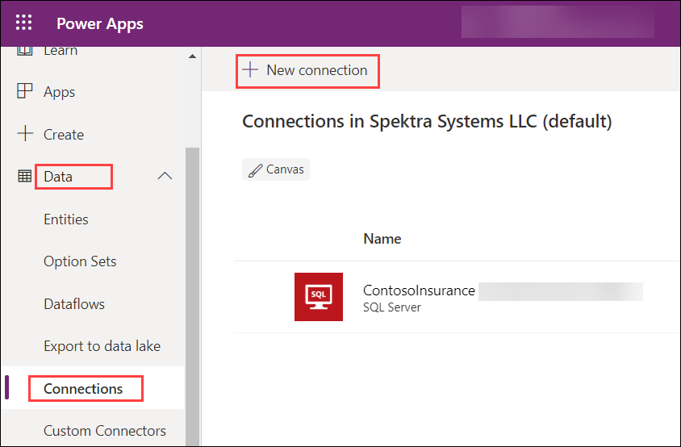
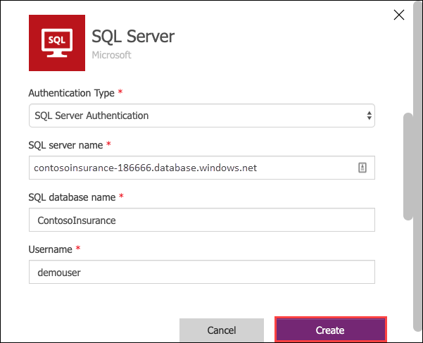
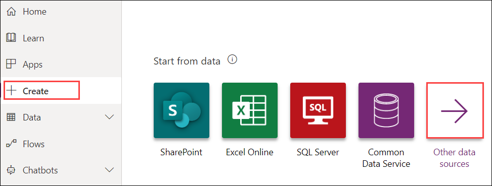
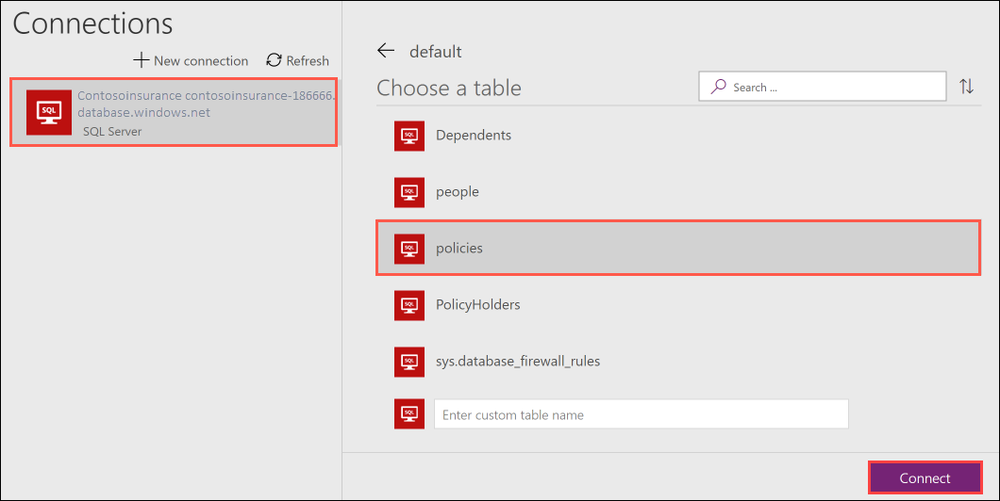
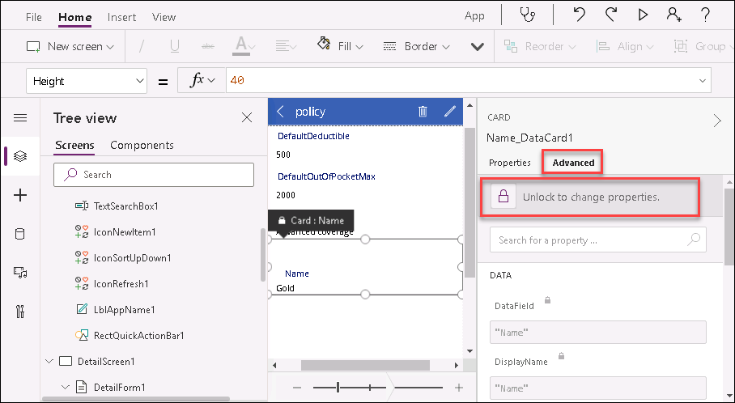

## Exercise 10: Create an app in PowerApps

Duration: 15 minutes

Since creating mobile apps is a long development cycle, Contoso is interested in using PowerApps to create mobile applications to add functionality not currently offered by their app rapidly. In this scenario, they want to be able to edit the Policy lookup values (Silver, Gold, Platinum, etc.), which they are unable to do in the current app. In this task, you get them up and running with a new app created in PowerApps, which connects to the `ContosoInsurance` database and performs basic CRUD (Create, Read, Update, and Delete) operations against the Policies table.

### Task 1: Sign up for a PowerApps account

1. Go to PowerApp web portal and sign up for a new account, using the same account you have been using in Azure. 

2. Copy and paste the url- ```https://web.powerapps.com``` in your LabVM browser and signup.

   
### Task 2: Create new SQL connection

1. From the PowerApps website, expand the **Data** option from the left-hand navigation menu, then select **Connections** and click on **+ New connection** button.

  

2. Type **SQL** into the search box, and then select the SQL Server item in the list below.

    

3. Within the SQL Server connection dialog, enter the following:

   - **Authentication Type**: Select **SQL Server Authentication**.
   - **SQL Server name**: Enter the server name of your Azure SQL database. For example, `contosoinsurance-186666.database.windows.net`.
   - **SQL Database name**: Enter **ContosoInsurance**
   - **Username**: Enter **demouser**
   - **Password**: Enter **Password.1!!**

   

4. Select **Create**.

### Task 3: Create a new app

1. From the PowerApps website homepage, click on **+Create** and click the right arrow denoting **other data sources**.

   

2. A new tab will open, there select **New** on the left-hand side and then select the **SQL Server connection** you created in the previous task.

    

3. Select the **policies** table from the Choose a table list.

   

4. Select **Connect**.

### Task 4: Design app

1. The new app is automatically created and displayed within the designer. Select the title for the first page (currently named [dbo].[Policies]) and edit the text in the field to read **Policies**.

    

2. Select the **DetailScreen1** screen in the left-hand menu.

    

3. Reorder the fields on the form by selecting them, then dragging them by the **Card: <field_name>** tag to the desired location. The new order should be **Name**, **Description**, **DefaultDeductible**, then **DefaultOutOfPocketMax**.

    

4. On the form, edit the **DefaultDeductible** and **DefaultOutOfPocketMax** labels to be **Default Deductible** and **Default Out of Pocket Max**, respectively. To do so, select the field and type the new title in quotes within the formula field.

  > **Hint**: You need to select **Unlock** in order to change fields.
    
  

5. Rename the screen title to Policy by typing "Policy" in quotation marks within the formula field.

    

6. Select EditScreen on the left-hand menu.

7. Repeat steps 4-6 on the edit screen.

### Task 5: Edit the app settings and run the app

1. Select **File** on the top menu.

    

2. Select **Name + icon** under Settings and enter in a new **Name**, such as "PolicyConnect Plus".

    

3. Select **Save** on the left-hand menu to save the app to the cloud, then select the **Save** button below.

    

4. After saving, select the left arrow on top of the left-hand menu.

    

5. Select **BrowseScreen1** from the left-hand menu and then select the **Run** button on the top menu to preview the app. You should be able to view the current policies, edit their values, and create new policies.

    

6. Browse through the various policies in the app to explore the functionality.

7. Click on the **Next** button.
